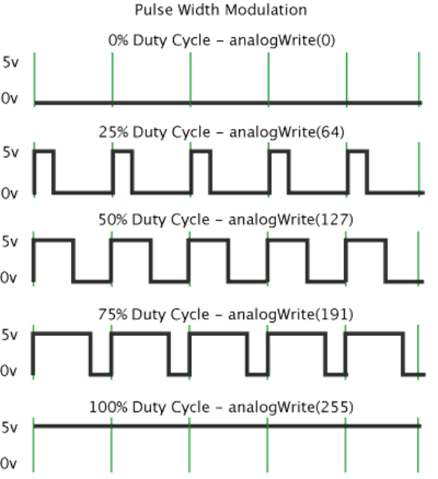

# Pulse Width Modulation (PWM)

Pulse width modulation is a technique that controls the power delivered to a device by switching the power on and off very rapidly.

## Duty Cycle

- **Definition:** The duty cycle is the proportion of time the power is on versus off.

- **Purpose:** It determines the effective voltage or power output.

## Frequency

- **Definition:** Frequency is the number of times the PWM signal repeats its on/off cycle per second.

- **Role:** This frequency is critical in determining how the duty cycle (the ratio of on-time to off-time) translates into an effective average voltage or power delivered to the load.

## Period

- **Definition:** The period in PWM is the total duration of one complete cycle of the on/off pattern.

- **Calculation:** It is simply the inverse of the frequency (i.e., Period = 1 / Frequency).

## Capture/Compare Register (CCR)

### Timer Counter

- **Definition:** A timer counter is a dedicated hardware register that increments (or decrements) its stored value at a fixed rate determined by a clock source.

### CCR Modes

- **Capture Mode:**

  - **Definition:** Records (or "captures") the current timer counter value when a specific external event occurs, effectively timestamping that event.

- **Compare Mode:**

  - **Definition:** Holds a preset value that the timer counter is continuously compared against.

  - **Function:** When the counter reaches this value, a predefined action (such as toggling an output or generating an interrupt) is triggered.

> **Note:** In standard PWM generation, the compare mode of the CCR is primarily used to define the duty cycle. Capture mode is generally reserved for recording the timer counter value in response to an external event, which isn't typically part of the PWM signal generation process.

### How the CCR Relates to PWM

- **CCR in Compare Mode:** The CCR holds a preset value. When the timer counter reaches this value, the output changes state (typically from high to low). This change defines the duty cycle.

 

## PWM Calculations

PWM calculations focus on two main aspects: setting the PWM signal's frequency (or period) and establishing the desired duty cycle.

### Frequency Calculation

- **Key Registers:** Auto-Reload Register (ARR) and the prescaler.

- **Concept:** The timer counts from 0 to ARR, then resets. The rate at which the timer counts is determined by the system clock and a prescaler that divides that clock.

### Duty Cycle Calculation

- **Key Registers:** Capture/Compare Register (CCR) and the ARR.

- **Concept:** The duty cycle is the fraction of one period during which the signal is active (e.g., high). The CCR sets the point in the period where the output changes state.

**my personal intuition**  
A PWM signal can be viewed as a timer signal that is shaped or modulated by the CCR to produce the desired pulse width and duty cycle.
